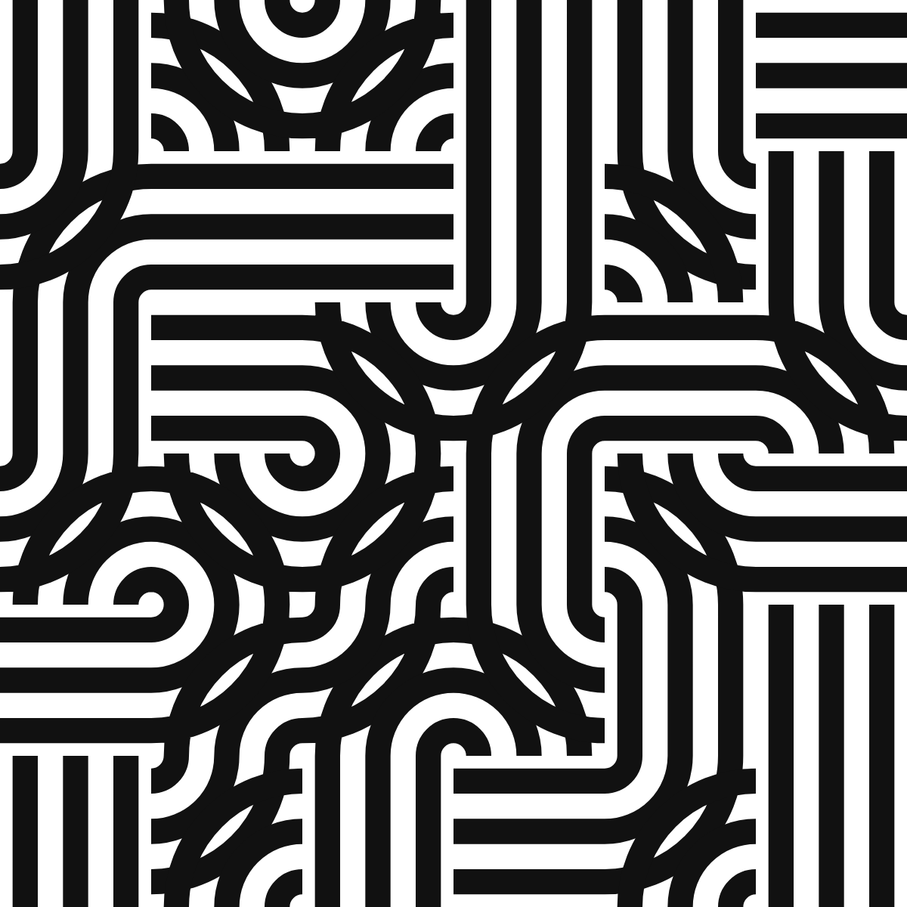
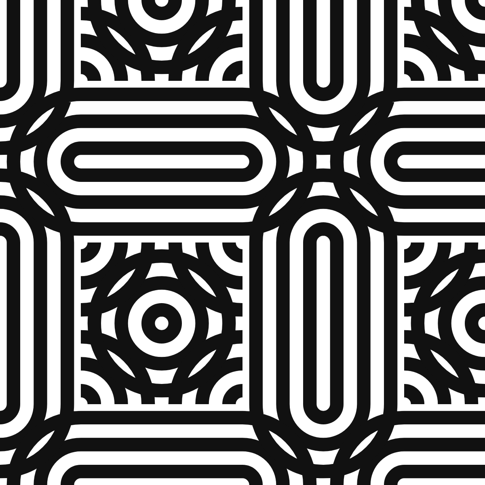
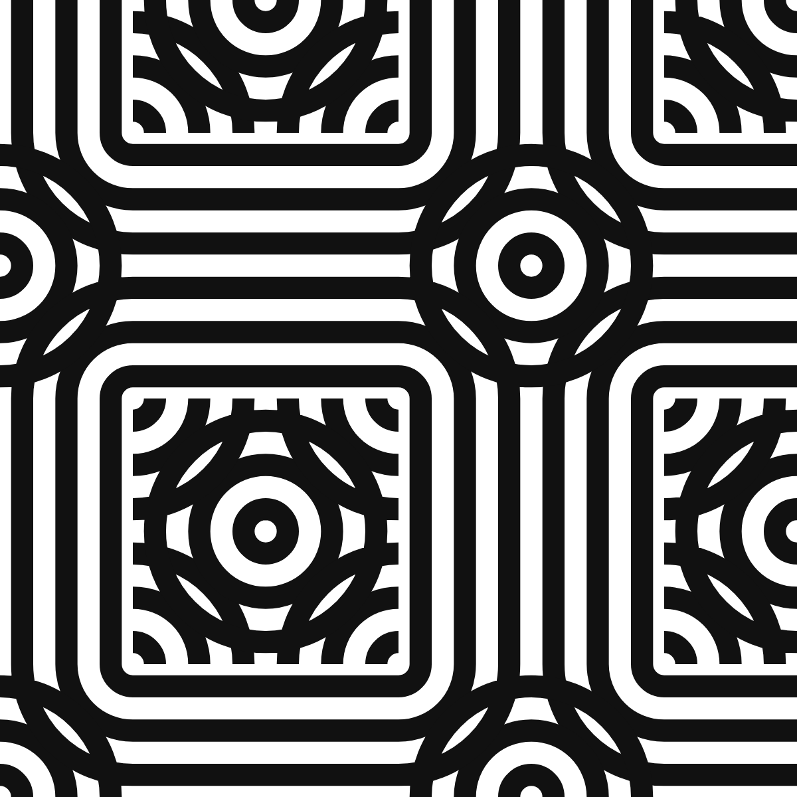
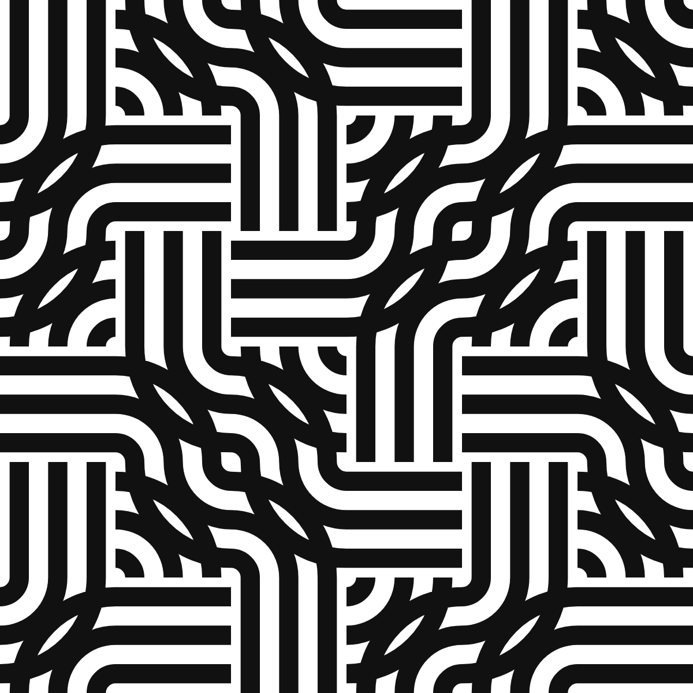
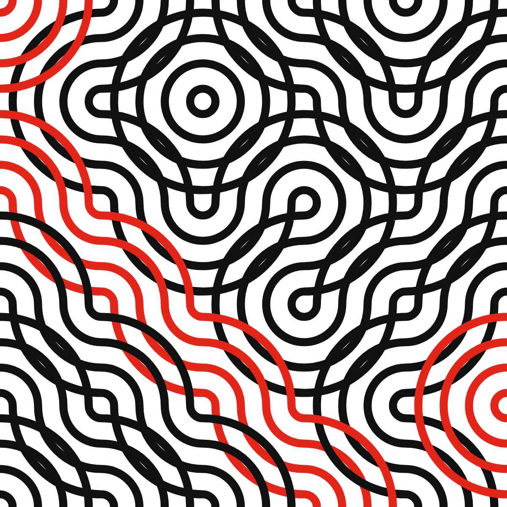
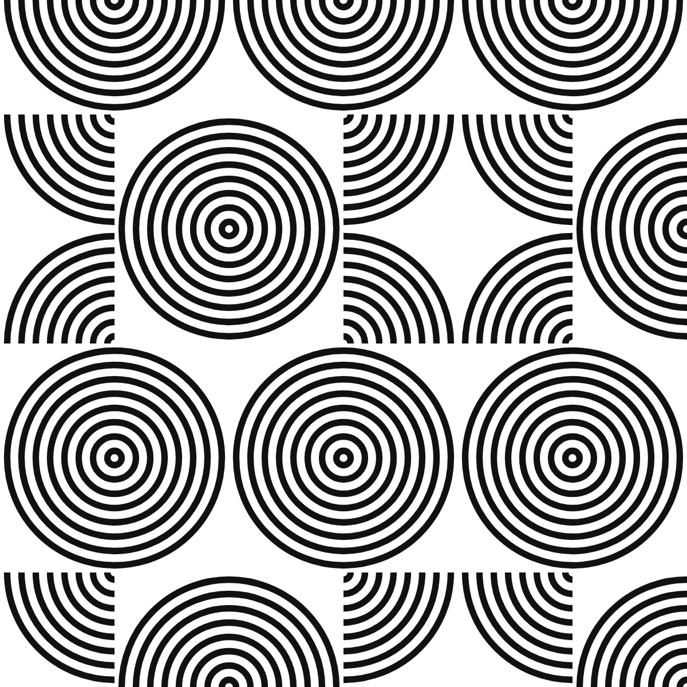
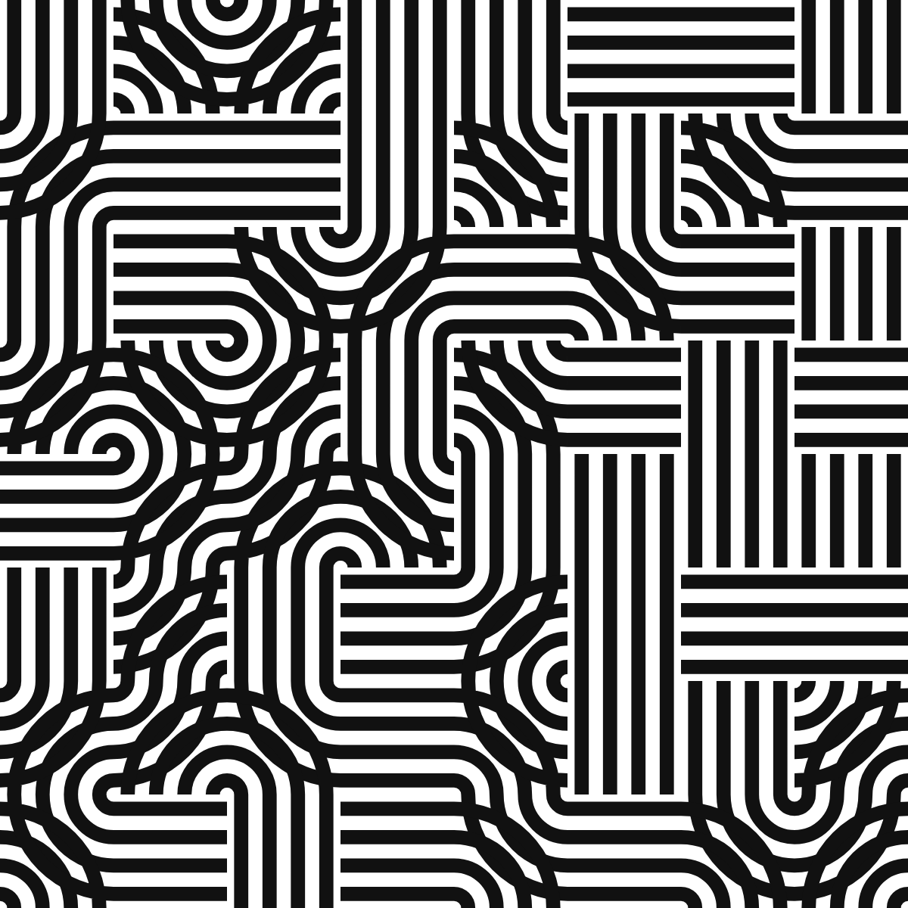
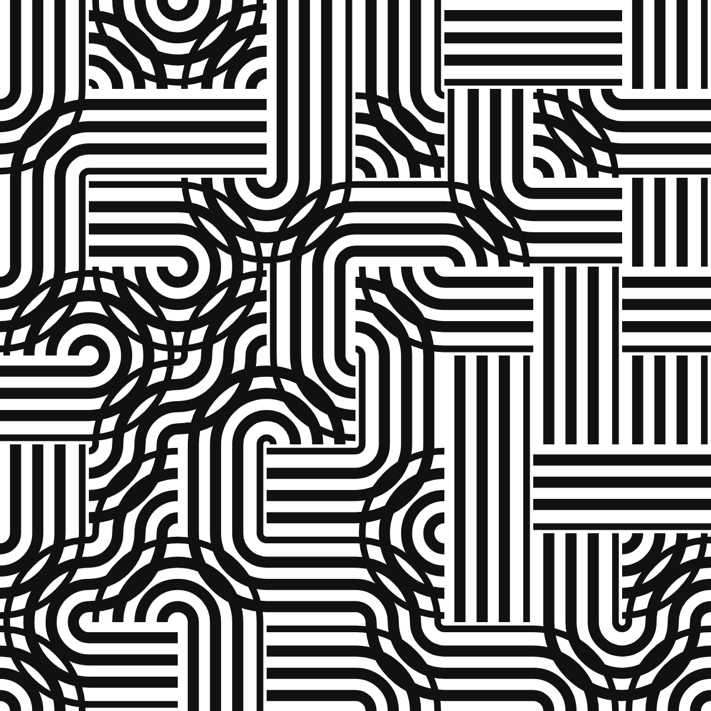

# Stripe Tiles: Band Chains and Seam-Free Lateral Motion in N-Stripe Truchet Tilings

**Jose “Jossi” Fresco Benaim** — SomosUno Digital, Madrid, Spain · jossif@gmail.com — ORCID 0009-0000-2026-0836  
*8 September 2026 · preprint*

> Built by `scripts/paper-stripe-tiles.ts` (figures, numbers) and a docx-js script (this file and `stripe-tiles.docx`) from one content source. Edit neither by hand: change the source and rebuild.

## Abstract

A stripe tile draws each base curve of a Truchet-style square tile as N parallel offset curves that meet every side of the cell at the fixed fractions (k + ½)/N. The equal-subdivision rule that lets such tiles continue across any edge under any rotation or reflection is known from work on generalised Truchet tiles. This note adds two things for the multi-stripe case. First, the natural unit of drawing is not the cell but the band chain, the route one bundle takes from border to border or around a loop; tracing chains rather than cells is what keeps N stripes accounted for consistently, at woven crossings and at the dead ends left by glyphs that use only two sides of their cell. Second, defining each stripe by its position on the chain's entry edge and propagating that position through the corner connectors yields a lateral motion of the whole field: a phase slide with no seam at any edge and an exact return at phase 1, which under mirror symmetry reads as rings radiating from every disc centre. A closed chain always returns a stripe to its own position, since a ribbon along a closed planar curve has a trivial normal bundle; an implementation that reported “Möbius loops” was found to be a tracing error, and the invariant is now a test. Everything is implemented in the open-source generator flowshape, where every figure in this note is a URL that reproduces it.

## 1. Introduction

Truchet's memoir of 1704 asked what happens when one asymmetric tile is dropped into every cell of a grid in a random orientation; Smith's arc variant, two quarter circles joining the midpoints of adjacent sides, turned the answer into a field of wandering curves [1]. The line-and-circle idiom of Bauhaus posters and textiles is, almost without exception, the same object with more stripes: bundles of parallel lines following straight runs and quarter turns on a square grid, meeting at woven crossings, fusing under mirrors into concentric discs. A generator for that idiom needs N-stripe tiles, and building one raises two questions that are engineering-shaped rather than mathematical. What is the right unit of drawing when a tile carries N stripes that continue into its neighbours? And can the stripes be made to move sideways along their bands, so that the field rolls and the discs ripple, without a seam appearing at any cell edge?

The continuity condition itself is settled. Reimann showed that subdividing the sides of a polygon into equal segments lets arcs from adjacent tiles form continuous curves in any orientation [2, 3]; Virolainen stated the rule for stripes explicitly, including stripes that cross, and classified edge segmentations by symmetry [4, 5]; Wendt used the same classification for duotone tiles [6]; Carlson's multi-scale tiles and Mitchell's generalisations use fixed endpoints at thirds of a side [7, 8]. For single strands, Glassner traced bands tile by tile to count and orient them in Celtic knotwork [9], Kaplan and Cohen built each thread as a circular list and drew per thread [10], and Ahmed rendered parallel line bands through Truchet-like tiles and recommended tracking individual lines across tiles rather than drafting more tiles [11]. What that literature does not state is the chain as the carrier of N stripes, or a transverse motion of the stripes within their bands. Those are the two contributions here, together with a cautionary remark on an obstruction that does not exist.

## 2. Stripe tiles

Take the unit square. A **base curve** is either a line between two opposite sides or a **corner connector** between two adjacent sides: the quarter arc centred on their shared corner, the chord of that arc, or the elbow through the point at equal distance along both sides. A **glyph** is a set of base curves that uses each side at most once. A **stripe tile** draws every base curve of its glyph as N offset curves, stripe k meeting each side of the cell at the fraction

```
t_k = (k + ½) / N,   k = 0, …, N − 1
```

along that side. For a line the stripes are parallel lines; for an arc centred on a corner they are concentric arcs with radii t_k; for the chord and the elbow, the corresponding offsets. Smith's tile is the case N = 1 with the two quarter-arc glyphs. Because the set {t_k} is symmetric under t ↦ 1 − t, the crossing positions on a side are the same whichever way the cell and its neighbour are oriented, so any glyph continues into any other across any edge under any of the eight symmetries of the square. That is Reimann's and Virolainen's condition, restated for half-offset positions; we use it as the setting.

The alphabets used here are small: the pipes (two arc glyphs, a horizontal line, a vertical line, and a crossing), arcs only, a single quarter disc, the chamfers and the elbow (which give chevrons and nested diamonds), lines only (hatch), and the knot (arcs and crossings). A crossing draws one band over the other by painting the under-band out with the paper colour along the over-band's centreline, one cell wide, before drawing the over-band; the cut is fixed to the cell, a point we return to. Placements are free, or a seeded m × m block extended by one of three plane groups: pmm (mirrors across both axes, which fuse four quarter discs into a disc), p4m (pmm with the diagonal mirror, where diagonal stripes meet as nested diamonds), or p4 (quarter turns about the supercell centre). Figure 1 shows one seed and one alphabet under the four placements.

   

*Figure 1. One seed, the pipes alphabet, N = 3, under free placement (left), pmm, p4m and p4 (right), on a 6 × 6 grid. The free placement has 19 chains, 21 of whose ends are dead ends inside the field; under pmm there are 18 chains, 3 of them closed loops. Reproduce: https://flowshape.art/#/p/bauhaus?v=1&seed=7&motif=0&symmetry=0&cell=100&repeat=0&stripes=3&render=0&width=0.5&tilt=0&accentEvery=0&phase=0 and the same URL with symmetry=1, 2, 3 and repeat=2.*

## 3. Band chains

Follow a base curve out of its cell through the side it exits, into the neighbouring cell through the facing side, and on. Since every glyph uses each side at most once, the continuation is unique or absent, and the base curves of the whole grid fall into disjoint **band chains**: open paths that run from one end to the other, or closed loops. An end is either the border of the frame or a **dead end**, a side that the neighbouring glyph does not use; the horizontal and vertical line glyphs leave two sides unused, so alphabets that contain them produce chains that stop inside the field, which is part of the pipes' look (Figure 1, left). Alphabets in which every glyph uses all four sides, such as the arcs alone or the knot, have no dead ends, and every open chain runs border to border (Figure 2).

The claim of this section is that the chain, not the cell, is the unit of drawing. Drawn cell by cell, N stripes are N independent facts per cell that happen to agree at the edges. Drawn chain by chain, a stripe is one object: its position is decided once, on the chain's entry edge, and carried along. That is what makes the lateral motion of Section 4 possible at all, and it is what keeps the crossing consistent, because the over-band and the under-band of a crossing belong to two different chains and are drawn in the order the chains dictate. The tracing is a walk: from every border side of every border cell, walk inward until the border, a dead end, or the start; then, for every base curve not yet visited, walk from it in one direction, and if that walk ends open, walk from it in the other direction too and stitch the two halves, so that a chain met in the middle still runs end to end. A walk is closed exactly when it returns to the segment it started from.



*Figure 2. Smith's two arc glyphs with N = 4 on a 5 × 5 grid: the N-stripe Truchet tiling, with every fourth band chain drawn in red to show the unit of drawing. There are 11 chains, 1 of them a closed loop, the rest running border to border; the alphabet has no dead ends. Reproduce: https://flowshape.art/#/p/bauhaus?v=1&seed=7&motif=1&symmetry=0&cell=120&repeat=0&stripes=4&render=0&width=0.32&tilt=0&accentEvery=4&phase=0*

## 4. Lateral motion

Let a stripe on a chain be defined by its position λ ∈ (0, 1) on the chain's entry side, measured along that side in a fixed convention (left to right on horizontal sides, top to bottom on vertical ones). Each base curve maps an entry position p to an exit position:

```
line:              p ↦ p
corner connector:  p ↦ r or 1 − r,  with r = p or 1 − p,
                   the choice fixed by which end of each side the corner occupies
```

The map is exact geometry: for an arc centred on the corner, r is the radius, and the arc meets the two sides at distance r from the corner along each. Propagating λ through the chain places every stripe, and because the exit position of one segment is the entry position of the next, on the same edge and in the same convention, the stripe is continuous across every edge of the chain for every λ, not only for λ in the rest set {t_k}. That gives the motion for free: replace t_k by

```
λ_k = (t_k + φ) mod 1,   φ the phase
```

and every stripe in the field slides sideways along its band by a common amount, with no seam anywhere. Under mirror symmetry the sliding stripes are rings radiating from every disc centre (Figure 3); on the pipes the band appears to roll (Figure 4). Since φ is folded through mod 1 before use, phase 1 is literally the phase-0 expression, and the loop closes byte for byte: the renders at φ = 0 and φ = 1 are identical strings (checked, see Section 6).

  

*Figure 3. The quarter-disc glyph under pmm, N = 8, at φ = 0, 0.25 and 0.5. The stripes slide outward from every disc centre; 19 chains, 4 of them closed. Reproduce: https://flowshape.art/#/p/bauhaus?v=1&seed=7&motif=2&symmetry=1&cell=100&repeat=2&stripes=8&render=0&width=0.45&tilt=0&accentEvery=0&phase=0, then phase=0.25 and phase=0.5.*

Two things go wrong in a naive implementation, and both are worth stating because they are where the seam comes back. First, at λ → 1 a stripe leaves its band at one edge and re-enters at the other; with N stripes over one cycle that is a field-wide jump every 1/N of a cycle. The remedy is to taper a stripe's weight to zero over the outer half-lane on each side of the band, so it fades out on one side and is born thin on the other; at rest the outermost stripes sit exactly at the taper's edge, so the static drawing is unchanged. Second, the cut that hides the under-band at a crossing must be fixed to the cell. Drawn per lane, it slides with the lanes and jumps when a lane wraps, cutting the under-band in a new place. Drawn once per crossing along the over-band's centreline, one cell wide, it covers the same region at rest and no longer depends on φ.

 

*Figure 4. The pipes alphabet, N = 4, at φ = 0 (left) and φ = 0.3 (right): 30 chains, 38 dead ends, and every stripe has moved along its band with no seam at any edge. Reproduce: https://flowshape.art/#/p/bauhaus?v=1&seed=7&motif=0&symmetry=0&cell=75&repeat=0&stripes=4&render=0&width=0.5&tilt=0&accentEvery=0&phase=0 and the same with phase=0.3.*

## 5. There is no Möbius obstruction

A first version of the tracer reported closed chains whose round trip composed to p ↦ 1 − p, and held those loops still on the grounds that no consistent shift could exist on them. A referee would object, and the objection is right: a ribbon along a closed curve immersed in the plane has a trivial normal bundle, its normal being the tangent turned by a right angle, so a stripe at transverse position p returns to p after one circuit whatever the loop does. The composition of the maps of Section 4 around any closed chain is therefore the identity, and every loop admits the shift.

The reported loops were an artefact of the walk, and the mechanism is instructive. A chain between two dead ends is never found from the border. The tracer met such a chain at an interior segment, walked in one direction only, and stopped at the dead end; the walk in the other direction, started later from the neighbouring segment, stopped at the first walk's start and was labelled closed. The resulting one-segment “loop” was a single quarter arc, whose map is p ↦ 1 − p. Walking both ways from wherever a chain is met, and defining closed as returning to the start segment, removed every such loop; the two halves were also, before the fix, drawn from their own entry positions, which put a seam between them under motion. The invariant is now a test in the repository: across the ${T.length} alphabet-and-placement cases of Table 1, over three seeds each, every segment lies on exactly one chain, every open chain ends at a border or a dead end, and no closed chain reverses a stripe.

## 6. Implementation and reproducibility

Stripe tiles are the pattern *bauhaus* in flowshape, an open-source, browser-based generator of deterministic patterns [12]. Two properties of that software matter here. The URL is the state: pattern, every parameter, seed and phase are in the address, so each figure caption above is a complete reproduction recipe. And the invariants of this note are tests: determinism, the byte-identical loop at phase 1, and the chain invariant of Section 5 all run in the suite. Every number in this note is produced by a script in the repository (scripts/paper-stripe-tiles.ts) from the same generator, never typed by hand.

| Alphabet | Placement | Chains | Closed | Dead ends | Border ends | Reversing |
|---|---|---|---|---|---|---|
| pipes | free | 171 | 0 | 241 | 101 | 0 |
| pipes | pmm | 151 | 42 | 105 | 113 | 0 |
| pipes | p4 | 165 | 12 | 192 | 114 | 0 |
| chevrons | free | 174 | 8 | 211 | 121 | 0 |
| chevrons | pmm | 244 | 74 | 210 | 130 | 0 |
| chevrons | p4 | 253 | 53 | 268 | 132 | 0 |
| hatch | free | 226 | 0 | 381 | 71 | 0 |
| hatch | pmm | 140 | 0 | 210 | 70 | 0 |
| hatch | p4 | 257 | 0 | 442 | 72 | 0 |
| knot | free | 76 | 4 | 0 | 144 | 0 |
| knot | pmm | 132 | 60 | 0 | 144 | 0 |
| knot | p4 | 108 | 36 | 0 | 144 | 0 |

*Table 1. Chain statistics on a 10 × 14 grid (cell 60 on a 600 × 840 frame), summed over seeds 1, 7 and 42, for four alphabets under three placements: 2097 chains, 289 closed, 2260 dead ends, and 0 closed chains that reverse a stripe. The hatch alphabet, lines only, has no loops; the knot, in which every glyph uses all four sides, has no dead ends.*

For the state of Figure 3, the largest frame-to-frame change in total drawn ink across one cycle of 200 samples is 1.17%, which is the taper of Section 4 doing its work rather than a discontinuity; without the taper, a full-weight stripe moves from one band edge to the other in one frame.

## 7. Related work

The prior-art scan that shaped this note is recorded in the repository. In brief: the equal-subdivision continuity condition is stated by Reimann [2, 3], Virolainen [4, 5] and Wendt [6], and used by Carlson [7] and Mitchell [8]; single-strand tracing and per-thread drawing are in Glassner [9] and Kaplan and Cohen [10]; multi-line bands through Truchet-like tiles, with weaving, are in Ahmed [11]; Truchet contours and their parities are in Browne [13]. None of these carries N stripes on a traced chain or moves the stripes transversely, and none treats loops under such a motion, which is the ground this note occupies. The note claims no new mathematics: offset curves, edge matching and the trivial normal bundle of a planar ribbon are all classical. Its contribution is a design rule, a unit of drawing, and a corrected intuition.

## Acknowledgements

The generator and this note were developed in collaboration with Claude Fable 5.1 (Anthropic), which drafted code and prose under the author's direction, ran the prior-art scan, and raised the objection that dissolved the Möbius claim of Section 5. Every construction was verified by the author through the repository's test suite; every number was produced by deterministic code, not by the model.

## References

- [1] Smith, C. S., and Boucher, P. (1987). The tiling patterns of Sebastien Truchet and the topology of structural hierarchy. Leonardo 20(4), 373–385. https://doi.org/10.2307/1578535
- [2] Reimann, D. A. (2010). Patterns from Archimedean tilings using generalized Truchet tiles decorated with simple Bézier curves. Bridges 2010 Proceedings, 427–430. https://archive.bridgesmathart.org/2010/bridges2010-427.pdf
- [3] Reimann, D. A. (2011). Decorating regular tiles with arcs. Bridges 2011 Proceedings, 581–584. https://archive.bridgesmathart.org/2011/bridges2011-581.pdf
- [4] Virolainen, S. (2017). Random hexagons and other pattern continuities. Proceedings of the XX Generative Art Conference (GA2017), 331–352. https://generativeart.com/GA2017/SeveriVirolainen_longtext.pdf
- [5] Virolainen, S. (2023). Pattern continuity in polygon tessellations. Bridges 2023 Proceedings, 53–60. https://archive.bridgesmathart.org/2023/bridges2023-53.pdf
- [6] Wendt, A. E. (2023). Pattern gradients with generalized duotone Truchet tiles. Bridges 2023 Proceedings, 461–464. https://archive.bridgesmathart.org/2023/bridges2023-461.pdf
- [7] Carlson, C. (2018). Multi-scale Truchet patterns. Bridges 2018 Proceedings, 39–44. https://archive.bridgesmathart.org/2018/bridges2018-39.pdf
- [8] Mitchell, K. (2020). Generalizations of Truchet tiles. Bridges 2020 Proceedings, 191–198. https://archive.bridgesmathart.org/2020/bridges2020-191.pdf
- [9] Glassner, A. (1999–2000). Celtic knotwork, parts 1–3. IEEE Computer Graphics and Applications 19(5), 19(6), 20(1).
- [10] Kaplan, M., and Cohen, E. (2003). Computer generated Celtic design. Proceedings of the 14th Eurographics Workshop on Rendering, 9–19. https://diglib.eg.org/handle/10.2312/EGWR.EGWR03.009-019
- [11] Ahmed, A. G. M. (2014). Line-based rendering with Truchet-like tiles. Proceedings of the Workshop on Computational Aesthetics (CAe '14), 41–51. https://doi.org/10.1145/2630099.2630111
- [12] Fresco Benaim, J. (2026). flowshape: 38 deterministic pattern generators for print-ready and audio-reactive generative art (v1.6.0). Zenodo. https://doi.org/10.5281/zenodo.22659360 (concept DOI 10.5281/zenodo.22180722). Source: https://github.com/Jossifresben/flowshape
- [13] Browne, C. (2008). Truchet curves and surfaces. Computers & Graphics 32(2), 268–281. https://doi.org/10.1016/j.cag.2007.10.001